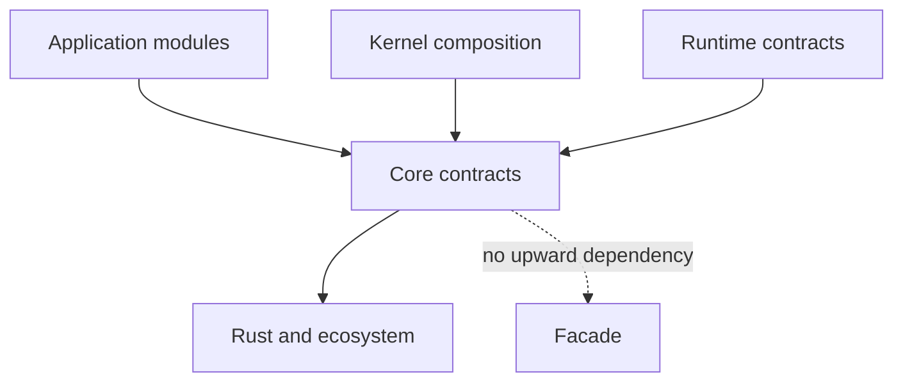

# rustclamp-core

The **Core component of RustClamp**, the framework in the
[`rustclamp`](https://github.com/rustclamp/rustclamp) repository. Core is intended
for minimal, domain-neutral contracts shared by framework components.

This is a companion package, not a standalone framework. The first public
contract is `Clock`, with typed `ModuleId`, `CapabilityId`, and `QualifierId`
identities plus `ClockCapability` and `Qualifier` markers for Kernel resolution.
The additive `Module`, `Requires<C>`, and `Provides<C>` traits describe module
identity, required capabilities, and provided values without imposing
construction or lifecycle methods. `Contribution` and `ContributionTarget`
provide the domain-neutral extension boundary for composition-time declarations;
each target owns validation and the runtime representation it builds. Core
defines contracts and identities; provider selection and resolution behavior
belong to Kernel.
The package builds alone with Rust 1.96.1 and has no external dependencies.
Publishing is disabled until licensing, registry ownership and the prototype API
have been reviewed.

Core is intended to contain only contracts that prove useful across application
domains. The dependency direction is downward:



| Baseline | Current result |
| --- | --- |
| External Rust dependencies | 0 |
| Public behavioral contracts | 1 (`Clock`) |
| Additive module contracts | `Module`, `Requires<C>`, `Provides<C>` |
| Contribution extension contracts | `Contribution`, `ContributionTarget` |
| Runtime-specific requirement | None |
| Package checks | Format, Clippy, tests, rustdoc |

Core defines contracts, not runtime behavior. The Clock consumer and resolver
comparison live in the Kernel repository. Future contracts must be tested against
facade-free consumers and the direct Rust alternative where useful. Composition
errors, dependency boundaries, and compiler diagnostics belong in the comparison
alongside runtime and binary cost.

```sh
cargo fmt --all -- --check
cargo clippy --offline --locked --all-targets --all-features -- -D warnings
cargo test --offline --locked --all-features
RUSTDOCFLAGS="-D warnings" cargo doc --offline --locked --no-deps --all-features
```

For coordinated checkout, architecture checks, measurements, and release policy,
see the [facade contributor guide](https://github.com/rustclamp/rustclamp/blob/main/CONTRIBUTING.md).
The configured remote is `https://github.com/rustclamp/core.git`; repository existence
and public visibility were verified during Phase 0.
