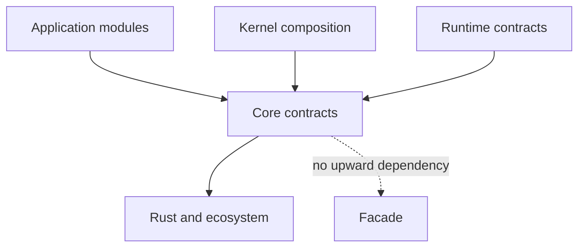

# rustclamp-core

Minimal shared Clamp contracts, added only when a prototype requires them.

Phase 0 scaffold. There are no public contracts yet. This package builds alone
with Rust 1.96.1 and has no dependencies. Publishing is disabled until licensing,
registry ownership and the first prototype API have been reviewed.

Core is intended to contain only contracts that prove useful across application
domains. The dependency direction is downward:



| Baseline | Current result |
| --- | --- |
| External Rust dependencies | 0 |
| Public behavioral contracts | 0 |
| Runtime-specific requirement | None |
| Package checks | Format, Clippy, tests, rustdoc |

There is no Core behavior to benchmark yet. Future contracts must be tested
against facade-free consumers and the direct Rust alternative where useful.
Composition errors, dependency boundaries, and compiler diagnostics belong in
the comparison alongside runtime and binary cost.

```sh
cargo fmt --all -- --check
cargo clippy --offline --locked --all-targets --all-features -- -D warnings
cargo test --offline --locked --all-features
RUSTDOCFLAGS="-D warnings" cargo doc --offline --locked --no-deps --all-features
```

For coordinated checkout, architecture checks, measurements, and release policy,
see the [facade contributor guide](https://github.com/rustclamp/rustclamp/blob/main/CONTRIBUTING.md).
The configured remote is `https://github.com/rustclamp/core.git`; repository existence
and public visibility were verified during Phase 0.
